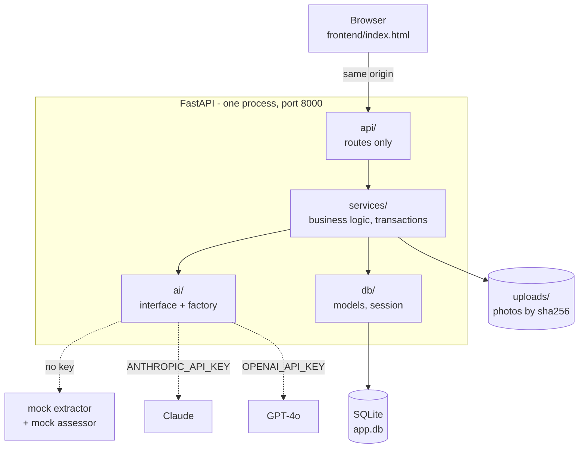
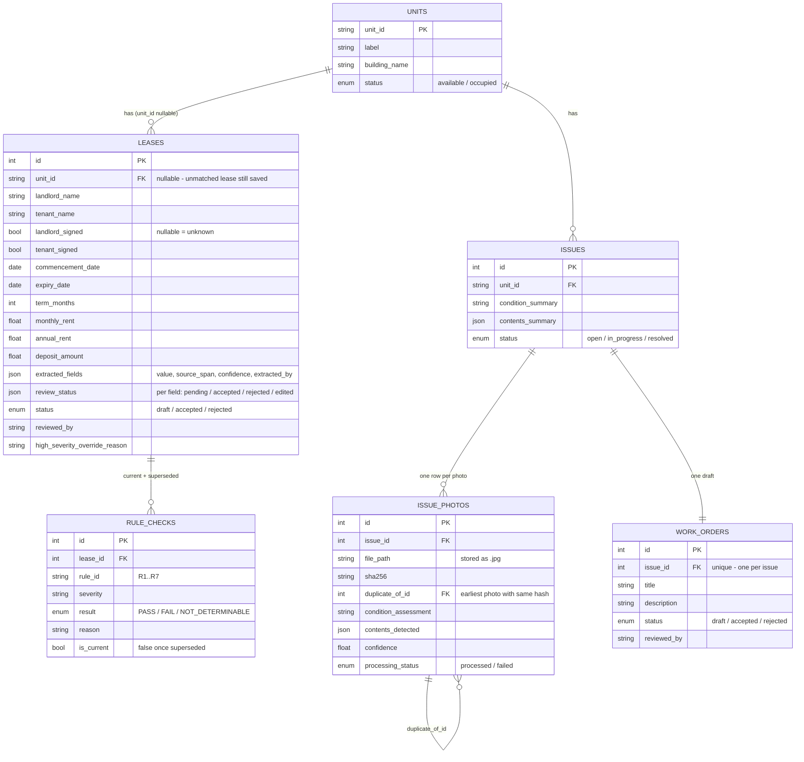

# Lease & Property Issue Agent

An owner uploads a lease. An agent reads it into a structured record,
keeps a source for every field it extracted, checks it against the
owner's rules, and matches it to a unit. Separately, a tenant or
inspector uploads photos of a problem. A second agent assesses the
photos and drafts a work order from them.

Both land on one screen. Open a unit and you see its lease, the rules it
passed or failed, and the issues raised against it. Nothing an AI
produced is final until a person accepts it, and every accepted value
records who accepted it.

FastAPI, SQLAlchemy, SQLite, and one HTML file. Runs with no API key and
no external service.

---

## Running it

Python 3.10+.

```bash
cd backend
python3 -m venv venv && source venv/bin/activate
pip install -r requirements.txt
uvicorn app.main:app --reload
```

On Windows: `py -m venv venv`, then `.\venv\Scripts\Activate.ps1`. If
PowerShell blocks the activation script, run
`Set-ExecutionPolicy -Scope Process -ExecutionPolicy Bypass` first. If
`uvicorn` isn't found, use `py -m uvicorn app.main:app --reload`.

Then open **http://localhost:8000**.

That is the whole setup. The backend serves the frontend, so there is no
second thing to start and no CORS to configure. On first run it creates
`app.db` and seeds it from `data/units.json`.

- API docs: http://localhost:8000/docs
- Health: http://localhost:8000/health

To drive Part A from the command line:

```bash
curl -X POST http://localhost:8000/leases/upload -F "file=@data/sample_lease.txt"
curl http://localhost:8000/units/MC-B-1204
```

In PowerShell, `curl` is an alias for `Invoke-WebRequest` and doesn't
understand `-F`. Use `curl.exe` instead.

### Tests

```bash
pip install -r requirements-dev.txt
pytest
```

118 tests. Each one gets a fresh in-memory database and its own temp
upload directory, so a run never touches your `app.db` and never writes
files into `uploads/`. Everything runs against the deterministic mocks,
so there is no key, no network call and no cost.

One test is different on purpose: `tests/test_migrations.py` runs the
real Alembic chain against a throwaway SQLite file — `upgrade head`,
`alembic check` for drift between the migrations and the models, then
`downgrade base`. Every other test builds its schema with
`create_all()`, which never exercises a migration. Without this, the
upgrade path for an existing database would be untested, and it was
broken for a while precisely because nothing ran it.

### Using a real model instead of the mock

Set one variable and restart:

```bash
export ANTHROPIC_API_KEY=sk-ant-...    # pip install anthropic
# or
export OPENAI_API_KEY=sk-...           # pip install openai
```

Anthropic wins if both are set. With neither, the mocks run. Nothing
else changes: `app/ai/factory.py` is the only file that knows which
implementation exists, both providers get the same prompts, and both
answers are validated against the same schema.

Note that nothing here auto-loads a `.env` file. Export the variables.

### Serving the frontend somewhere else

If you'd rather run the page on its own port or put it behind a CDN, set
`API_BASE` in `index.html` to the backend's URL and name that origin:

```bash
CORS_ORIGINS=http://localhost:5500 uvicorn app.main:app --reload
```

It's a comma-separated allowlist. It never becomes a wildcard.

---

## Architecture

One FastAPI process. The browser talks to it, it talks to SQLite, and it
talks to an AI provider only when a key is set.



The layers, and the rule each one follows:

```
api/        HTTP only. Parse, delegate, serialize. No business logic.
services/   Business logic and orchestration. Owns the transaction.
ai/         Interfaces, plus mock / Anthropic / OpenAI implementations.
db/         Models, session, enums, seed.
schemas/    Request and response shapes, and edit validation.
```

Nothing outside `ai/` imports a concrete AI implementation. That one
boundary is what makes the provider swappable by environment variable.

### The two flows

**Part A, lease.** Upload a `.txt` lease. The extractor returns fields,
each with a source span, a confidence, and which extractor produced it.
The lease is matched to a unit by its premises text, saved as a draft,
and the seven rules in `owner_ruleset.json` run against it. A person then
accepts, rejects or edits each field. Editing re-runs the rules, so a
displayed PASS always describes the lease as it stands now. Finalising
accepts the lease and flips the unit to occupied — unless a
high-severity rule is failing.

**Part B, issue.** Upload photos against a unit. Each photo is checked as
a real image, hashed, stored under its hash, and assessed on its own. The
per-photo results are aggregated into one condition summary, and a work
order is drafted from that. A person accepts, rejects, or edits the draft.

**The join.** `GET /units/{id}` returns the unit, its leases with rule
checks and provenance, and its issues with photos and work orders. One
request, one screen. Neither feature had to change its storage to make
that work, because the unit is the key both hang off.

### Repo layout

```
backend/
  app/
    api/        routes only
    services/   business logic, orchestration, transactions
    ai/         interfaces + mock / Anthropic / OpenAI implementations
    db/         models, session, enums, seed
    schemas/    request/response shapes, edit validation
  alembic/      migration environment and versions
  data/         owner_ruleset.json, units.json, sample_lease.txt
  tests/        118 tests
  uploads/      issue photos at runtime, served at /uploads/<sha256>
frontend/
  index.html    the entire frontend, served by the backend at /
```

---

## Data model



Four things in this schema are doing real work.

**Every field is stored twice, on purpose.** `monthly_rent` is a typed
column you can query and index. `extracted_fields` is a JSON record of
what the AI originally claimed for it — the value, where it came from,
how confident it was, and which extractor produced it. When a human edits
the field, the column changes and the claim doesn't. That is what lets
you answer "what did the model say, and what did the person change it
to", which is the whole audit trail.

**AI results are rows, not blobs.** `RuleCheck` and `IssuePhoto` are
their own tables, so each result stays individually addressable,
reviewable, and traceable to the input that produced it. A JSON array on
the parent would have been less code and would have made every one of
those impossible.

**`Lease.unit_id` is nullable.** A lease we can't match to a unit is
still a real document. It gets saved as a draft with R7 =
NOT_DETERMINABLE instead of being rejected at the door.

**`Issue.unit_id` points at the unit, not the lease.** A broken water
heater is a fact about the apartment, whoever happens to be renting it.

---

## Main decisions

**One service, not two.** Both features hang off the same resource, the
unit, and the product's value is seeing them together on one screen.
Splitting them now buys a network hop and two datastores to render that
screen.
*Trade-off:* photo assessment is the piece most likely to need separate
scaling later, so it already sits behind its own service and assessor
interface. Pulling it out is a deployment change, not a rewrite.

**The model does one job, behind an interface.** It turns a document or
image into structured fields. Validating against the ruleset, matching a
unit, refusing to guess, routing to a human — all deterministic code
around it. That's why the whole review pipeline is testable with no API
key, and why swapping Anthropic for OpenAI is one environment variable.
*Trade-off:* the default mock is a labelled-line parser, so what a
reviewer runs out of the box is weaker than the version with a key.
Better than a demo that only works if you pay for it.

**Every extracted field is stored twice.** The typed column
(`monthly_rent = 9000`) is the current truth — queryable, indexable, what
the rule engine reads. The `extracted_fields` JSON is what the AI
claimed: value, source line, confidence, and which extractor produced it.
Editing changes the column and leaves the claim alone, so the difference
between them is exactly what a human corrected.

**AI results are rows, not blobs.** `RuleCheck` and `IssuePhoto` are
their own tables, so each result stays individually addressable,
reviewable, and traceable to the input that produced it. A JSON array on
the parent would have been less code and made all three impossible.

**One accepted lease per unit, enforced by the database.** A unique index
on `unit_id` where `status = 'accepted'`. It has to live in the database:
if two people accept different leases for the same apartment at the same
moment, both requests read "no accepted lease yet" and both write. Only
the database settles that. The API checks first too, so the ordinary case
gets a clear 409 instead of a raw constraint error.
It's *partial* because a unit collects many draft and rejected leases
over the years. Only "accepted" is exclusive.

**Rule checks are superseded, never deleted.** Editing a field re-runs the
rules. Old results are marked `is_current = False` and kept. The story
worth having is "R1 failed, someone fixed the deposit, R1 passed" — if
you overwrite, you only ever see the ending. This is a fix, not an
original design: the first version deleted and recreated every row, which
destroyed exactly the history the product is sold on.

**"I don't know" is a real answer.** The system never fills in a guess.
If the extractor can't find a field, it leaves it out. If a rule doesn't
have the data it needs, it says NOT_DETERMINABLE.
You can see it in the sample lease. Its signature lines are blank, so R5
comes back NOT_DETERMINABLE instead of PASS. A text file can't tell you
whether someone signed.
Getting this right took a rewrite. Signatures used to be checked by
searching the whole document for the words "landlord" and "signature".
That meant both parties always got the same answer, "unknown" was
impossible, and a lease that said the tenant had *not* signed still
showed a green PASS on a high-severity rule.
*Trade-off:* the demo looks weaker. Seven green PASSes read better than
six and an "I don't know". I'd rather be right than look right.

**Severity blocks. Confidence doesn't.** These look similar and are not.
`severity` is the owner's rule, written in their own ruleset file, so a
failing high-severity rule stops the lease being accepted. You can
override it, but you have to say why, and the reason is saved on the
lease.
Confidence is the machine's opinion of itself. It blocks nothing. It only
answers "which field should I look at first". A model's guess about its
own reliability should never overrule a person.
Each field also records `extracted_by`, because the same 0.65 means two
different things: from the label matcher it means the label matched
weakly, so go read that line; from a model it means the model hedged, so
go read the clause.
*Trade-off:* an override instead of a hard block. Owners do waive their
own rules by agreement, and a system that simply refuses gets worked
around outside the system, where nothing is recorded.

**SQLite now, Postgres later, Alembic from the start.** The ORM makes the
move a connection-string change. Alembic is there because `create_all()`
only creates missing tables — it does nothing for a new column on an
existing one, so without migrations every column added after someone's
`app.db` exists would silently be absent. Fresh clone needs nothing;
existing `app.db` runs `alembic upgrade head`.
*Trade-off:* SQLite has no concurrent writers and no real pooling. Fine
for one owner and a demo, first thing to change under load.

**Leases are plain text, not PDF.** Extraction and validation are the
interesting problem. PDF text extraction is solved and separable — it
would sit in `api/leases.py` and touch nothing downstream.
*Trade-off:* real leases arrive as PDFs and scans, so this is the biggest
single gap between the demo and the product.

---

## Things added

The subject underneath both features is traceability, so these seemed
part of the job rather than extras:

- `reviewed_by` and `decision_at` on every decision, required whenever a
  lease or work order is accepted or rejected.
- Full rule-check history, so an edit's before-and-after effect survives.
- Photos stored by SHA-256, so an identical photo is written to disk once,
  and `duplicate_of_id` points at the earliest upload with that hash.
- Rules re-run on every edit, so a displayed result never describes data
  a human already overwrote.
- Per-photo failure isolation: one assessor call failing records a
  labelled placeholder instead of losing the other photos, the issue, and
  the work order.
- Uploads validated by actually decoding them with Pillow, not by
  trusting the `Content-Type` header.
- The high-severity gate, with the recorded override.

---

## Where it breaks first

### At scale

Grouped by where the problem lives. The query count is measured; the rest
is reasoned from the code, not load-tested, and I'd want real numbers
before acting on any of it.

**The first thing to break is architectural, not the database:** AI calls
run inside the request, so a handful of concurrent uploads fills every
worker. Nothing else on this list matters until that is fixed.

#### Architecture

- **AI calls run inside the request.** A lease upload holds a worker for
  the whole model call, and an issue with twelve photos makes twelve
  vision calls before it returns. The routes are sync (`def`, not `async
  def`), so each one occupies a threadpool slot while it waits on the
  network. A few concurrent uploads fill the pool and everything else
  queues behind them until the proxy times out. The fix is a queue and
  workers, and it's also what makes everything below it scalable.
- **Slow work and fast work share the same workers.** Listing units and
  assessing twelve photos are served by the same process with no
  isolation between them. One tenant uploading a large issue degrades
  every other request. Separate pools, or separate services, is the
  eventual answer — the module boundaries are already drawn where I'd
  split.
- **Photos live on local disk, so a second instance is impossible.**
  Start another process to absorb load and it can't see the files the
  first one wrote. The usual answer to the two points above — run more of
  it — is blocked until storage moves to S3 or equivalent. It's a driver
  swap because storage is already content-addressed, but it has to happen
  before horizontal scaling is possible at all.
- **Static assets are served by the API process**, so page requests
  compete with API requests for the same workers.
- **No caching layer anywhere.** Every read goes to the database, and the
  ruleset JSON is re-read and re-parsed on every rule run.

#### Database

- **SQLite has a single writer.** It locks the whole database on write,
  so two people finalising leases at the same moment serialise, and under
  real concurrency you get `database is locked` rather than slowness.
  That's a handful of writes per second, not thousands. Postgres is a
  connection-string change and it is the second thing I'd do.
- **Unit matching reads the entire table.** `db.query(Unit).all()` runs
  on every lease upload and matches in Python. Fine at the five units in
  `units.json`; at fifty thousand it's a full table read and a linear
  scan per upload, and it gets slower exactly as the portfolio grows.
  It needs to be an indexed lookup, not a scan.
- **The unit view has no ceiling and N+1s.** `GET /units/{id}` lazy-loads
  leases, then rule checks, then issues, then photos, and returns all of
  it as one object. One unit with three leases and no issues already
  costs **7 SQL queries** (measured). A unit with five years of history
  returns five years of history, in one response, with no pagination
  anywhere to stop it. `selectinload` fixes the query count; only
  pagination fixes the payload.
- **Provenance lives in JSON columns that can't be queried.**
  `extracted_fields` and `review_status` are exactly the data you'd want
  to ask questions of — *which fields get corrected most often, which
  leases were accepted over a failing rule* — and on SQLite that means
  reading every row and filtering in Python. Postgres JSONB with a GIN
  index makes those real queries. This is the cost of the dual-storage
  decision, and it's worth naming.
- **History grows without bound and nothing archives it.** Superseded
  rule checks are kept on purpose, but every review writes seven more
  rows, and `Lease.rule_checks` loads every row the lease ever had and
  filters in Python. Keeping the history is right; loading all of it on
  every read is not. It needs `WHERE is_current` at the query level, and
  an archival horizon beyond that.

#### Implementation

- **Uploads are held entirely in memory.** Every file is read with
  `f.file.read()`. There's a 10 MB cap per photo but none on the number
  of photos per request, so fifty photos is 500 MB of RSS for one
  request. A few concurrent is an out-of-memory kill, not a slow
  response.
- **A new SDK client is constructed per call**, so every request builds a
  fresh connection pool.

#### Edge and access

Nothing sits in front of this app, and that becomes a scaling problem
before it becomes a security one.

- **Uvicorn is exposed directly.** No gateway, no reverse proxy. In
  production something has to terminate TLS, cap request size and
  duration, and load-balance across instances — and the moment there is
  more than one instance (see Architecture above), a load balancer stops
  being optional. Today there is nowhere to put a global timeout or a
  body-size limit except inside the app itself.
- **No rate limiting, so one caller can take everything.** Worker slots
  and AI spend both. And with no authentication there is no identity to
  rate-limit *by*, which is the real point: auth is a prerequisite for
  scaling, not only a security feature. You cannot shed load fairly, set
  per-owner quotas, or answer "which customer is generating this spend"
  without knowing who is calling.
- **Every query returns everything.** There is no owner column on units,
  so the database is one undifferentiated pile. That is fine for the
  single owner in `units.json` and wrong the moment a second landlord
  exists — not as a missing feature but as a data leak. Adding
  `owner_id` later means backfilling who owns what and then auditing
  every query in the codebase; one missed filter is a customer seeing
  another customer's leases. It is one column and a filter today.
- **Roles do not exist.** A tenant reporting a leak, an inspector
  uploading photos, a manager editing fields and an owner overriding a
  failing high-severity rule are four different privileges, and today
  they are the same anonymous caller. What to build is in *Security and
  roles* below; the point here is that it also caps how far this can
  scale.

#### Cost and third parties

- **Provider rate limits and spend.** A model call per lease and per
  photo means volume translates directly into money and into 429s. There
  is no retry, no backoff and no timeout anywhere, so the first busy day
  produces failed uploads rather than slow ones. Batching, caching
  identical documents by hash, and a per-owner budget all belong here.

### Current limitations

These don't need volume to show up. Every one is reproducible today,
against the sample data in `data/`.

**Prose leases extract nothing.** The mock reads `Label: value` lines.
Give it the same lease written as sentences:

> This Agreement is made between Marina Crest Holdings W.L.L. and Ahmed
> Al-Sayed. The Landlord lets Apartment 1204 in Tower B to the Tenant for
> twelve months from 1 March 2025, at a rent of nine thousand Qatari
> Riyals each month.

**0 fields extracted, no unit matched, all seven rules
NOT_DETERMINABLE.** That's the correct failure — it refuses rather than
guessing — but it's still a failure, and real leases are prose. This is
what the model path exists for.

**A postal address matches a unit.** Unit matching falls back to any 3-4
digit number, so:

```
Premises: Ground floor retail, 1204 Marina Road, Doha
```

**matches `MC-B-1204`.** Wrong unit, and no second candidate is ever
reported to the human — in a product built entirely around human review.

**Duplicate leases aren't detected.** Upload `sample_lease.txt` twice and
you get two independent drafts on the same unit. Photos are deduplicated
by hash; leases are not.

**Adding a rule does nothing.** The ruleset JSON's `"check"` strings are
decorative — the logic is hardcoded in `_check_r1` and friends. Add an
`R8` to `owner_ruleset.json` and it is **silently skipped**: no error, no
warning, no row. An owner editing their own rules would get no signal
that half of them do nothing.

**Orphan files.** Photos are written to disk before the transaction
commits, so a later failure leaves files with no database row, and
nothing ever cleans `uploads/`.

---

## What I left out

Deliberate scope, not oversight. The consequences of each are in *Where
it breaks first* above; this is just the list.

- **Authentication.** No login, so `reviewed_by` is a string the caller
  supplies about itself.
- **PDF, scans, and Arabic.** Plain-text leases only.
- **Background jobs.** Extraction and photo assessment run inside the
  request.
- **A flag entity.** The brief asks for flagging as a step of its own,
  and for a human to accept or reject each flag. See below.
- **Any issue state past `in_progress`.** No resolved, no vendor, no cost.
- **Tests against the real provider paths.** They need a key and a
  network call. I'd add contract tests against recorded responses.

---

## Where I'd take it next

### 1. Flags, and a review queue built around them

The biggest gap, and the one that most changes the product.

Today a reviewer sees thirteen fields that all look equally trustworthy,
and a button that accepts all of them at once. Confidence is computed,
stored, and displayed, and nothing acts on it. So a shaky field gets
rubber-stamped alongside twelve solid ones.

A `LeaseFlag` table — shaped exactly like `RuleCheck`: lease, kind,
field, message, severity, review state — fixes three things at once:

- **Missing fields** get somewhere to appear. A missing tenant name
  currently produces nothing, because no rule happens to mention it.
- **Low-confidence values** become something a person must resolve, not
  something they can accept-all past.
- **Values that look wrong** independent of any rule: a rent an order of
  magnitude off comparable units in the same building, an expiry before a
  commencement, a deposit of zero.

The screen then changes from "thirteen fields, good luck" to "two things
need you, eleven are fine." That's the difference between a demo and
something an owner uses on forty leases a week.

### 2. Security and roles

The problems are in *Edge and access* above. The plan:

1. **Login first.** `reviewed_by` and `override_reason` come from the
   session, never from the request body.
2. **Roles that match what people do.** A tenant reports issues and sees
   their own lease. An inspector reports and uploads photos. A manager
   reviews and edits fields but cannot override a failing high-severity
   rule. An owner can override, and every override is attributed.
3. **Authorisation per endpoint**, not one global check — accepting a
   lease and uploading a photo are not the same privilege.
4. **`owner_id` on units and scoped queries**, before there is data to
   backfill.
5. **Rate limiting and a request size and count cap**, which only become
   possible once there is an identity to limit by.
6. **An audit log as its own table**, rather than columns scattered
   across records.

### 3. Product features

The near-term ones, in the order I'd build them:

**PDF, scans, and Arabic.** Real leases arrive as PDFs, and in Doha a
serious version reads Arabic and mixed Arabic-English documents. Text
extraction and OCR slot in ahead of the extractor without touching
anything downstream; the language work belongs in the prompt and the
label sets. This is the largest single gap between the demo and the
product.

**Make the source clickable.** Store the lease text and let the UI jump
to the cited line and highlight it. "Source: line 12" that opens nothing
is a claim about traceability rather than traceability. Storing the
document content-addressed, like the photos, also gets duplicate-lease
detection for free.

**Ask about duplicate photos instead of deciding silently.** Today an
identical re-upload is stored, assessed, and flagged, and nobody is told.
The same photo can legitimately belong to two issues, so blocking would
be wrong — but the reporter should see *"this is the same photo as issue
#4, attach anyway?"* and answer.

**Owner-editable rules.** Make the `check` expressions real, evaluated
against the extracted record, so an owner can add or amend a rule without
a deploy. That turns the ruleset from a fixture into the product's actual
configuration surface.

**Renewal and expiry alerts.** The lease has commencement, expiry, and
term, and nothing uses them after validation. A calendar plus a nudge at
90, 60, and 30 days before expiry is the most useful thing you can build
on a lease record, and it's nearly free.

**Batch upload with a triage queue.** Drop in forty leases, get a list
ordered by how much attention each needs — flagged first, clean ones last
with one-click accept.

**Let tenants report by WhatsApp or email.** A tenant with a leaking
water heater takes a photo and sends it to the building manager on
WhatsApp. They are not going to open a web app, find their unit and fill
in a form.
So accept the photo where they already send it. An email address or a
WhatsApp number that receives the photo and creates the issue
automatically, with the same assessment and draft work order as an upload
through the site.
Nothing about the pipeline changes — only how the photo gets in. And it
is probably the difference between people using this and not.

---

### 4. Bigger pieces, if this became the real thing

**Count how often a human has to fix the AI.** Right now nobody knows how
good the extraction is. Not with the mock, and not with a real model
either — a model saying it is 95% sure does not mean it was right.
But the answer is already saved. Every field records whether the person
accepted it or edited it, and edited means the AI got it wrong.
So count the edits, field by field. You get something like: *out of the
last 100 leases, the deposit was fixed 14 times and the start date
twice.* Now you know which field to work on first.
And if you switch the mock for a real model, count again a month later.
If the fixes drop, the model helped. If they do not, it did not — and
without this you would never know either way.
No machine learning. Just counting what is already there.

**One page listing every active lease.** Unit, tenant, rent, expiry date.
All four are already stored and never shown together. From that same list
you get the total monthly income per building, the leases expiring in the
next 90 days, and the units sitting vacant and for how long. This is the
page an owner would keep open, and it's a query — no model, no forecast.

**Photos at the start and end of a tenancy, not just when something
breaks.** Today a photo belongs to an issue: something is broken, here is
a picture of it.
Let a set of photos belong to a lease as well. One set the day the tenant
moves in, one set the day they move out, shown side by side.
When a landlord wants to keep part of the deposit for damage, that
argument happens today from memory and old photos in a chat app. Here it
happens from dated photos of that exact apartment.
The limit, stated plainly: a person compares the two sets. The system
does not decide who owes what. That is a money question with a legal
side, so the job is to put the evidence in front of someone and stop
there.

---

